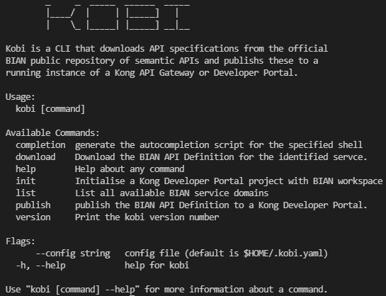

KOBI
=====================

- [KOBI](#kobi)
- [Overview](#overview)
- [Features](#features)
- [Compatibility](#compatibility)
- [Installation](#installation)
- [Configuration](#configuration)
- [Usage](#usage)
  - [Version](#version)
  - [List](#list)
  - [Download](#download)
    - [Arguments and Flags](#arguments-and-flags)
  - [Publish](#publish)
    - [Arguments and Flags](#arguments-and-flags-1)
- [License](#license)


# Overview

`Kobi` is a CLI to manage and automate the deployment of [BIAN](https://bian.org) service domain API specifications to a [Kong](https://konghq.com/)



# Features

* List all avaialbe BIAN service domain API Specifications for download or publishing
* Download a BIAN API service domain API Specification to the local machine
* Publish an API Specification from the BIAN API Repository directly to a running Kong Developer Portal
* Initialise the supporting files for a Kong Developer Portal

# Compatibility

Kobi is compatible with Kong Enterprise, version 1.0 and greater, and BIAN 9.1 and BIAN 12.0. Future releases will be compatibile with later versions of BIAN and Kong Konnect Cloud.

# Installation

The `kobi` CLI is developed on `golang` using `cobra` CLI. The executable `./kobi` is included in this repository, or it can be built from source (`go build`). For universal access, place the `kobi`  binary in a folder inclded on the path (e.g. `~/go/bin/kobi`).

# Configuration

`Kobi` uses environment variables to connect to the Kong Developer Portal.  

* `KOBI_KONG_ADDR` (Defaults to http://localhost:8001) - URL of Kong Admin API
* `KOBI_KONG_TOKEN` - RBAC token for configured Kong user with write permissions to the Kong Developer Portal Files API

# Usage

Use the `--help` flag of any command to view usage instructions in the terminal

## Version

Use to list the installed version of `Kobi`

```
➜  kobi-cli git:(main) ✗ kobi version
BIAN integration with Kong - kobi v0.0.1
```

## List

Use to list all service domains available at the remote `BIAN` repository.

```
➜  kobi-cli git:(main) ✗ kobi list --bian-version 9.1
-- Listing all available BIAN service domains --
ACFFulfillment
ATMNetworkOperations
AccountRecovery
AccountsReceivable
AdvancedVoiceServicesManagement
AdvancedVoiceServicesOperations
Advertising
...
```

## Download

Use to download a single service domain API specification to the local computer.

### Arguments and Flags

* Service (mandatory) - specify the service domain to download the API speicifcation for
* Output (`-o` or `--output`) - specify the filename to save the API spec to. Defaults to the name of the service domain.

```
➜  kobi-cli git:(main) ✗ kobi download --bian-version 12 --api-type iso CurrentAccount
download called for service CurrentAccount
Downloading API spec...
Decoding API spec...
Creating output file...
Writing output file...
Success!
```

## Publish

Use to publish a single service domain API specification to a running Kong Developer Portal.

### Arguments and Flags

* Service (mandatory) - specify the service domain to download the API speicifcation for
* Workspace (`-w` or `--workspace`) - specify the Kong Workspace to publish the API spec to. Defaults to the default workspace.

```
➜  kobi-cli kobi publish AccountsReceivable -w KOBI
Downloading API spec...
Decoding API spec...
Kong address is http://127.0.0.1:8001/KOBI/files
Sending HTTP Request...
Success...
```

# License
kobi is licensed with Apache License Version 2.0. Please read the [LICENSE](./LICENSE) file for more details.

